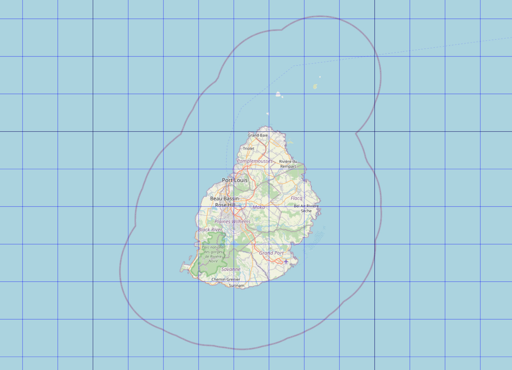

# Mauritius
FlightGear custom scenery for Mauritius Island, Indian Ocean

### This package contains:

*  Sir Seewoosagur Ramgoolam Intl (FIMP)
	* included new airport layout
	* osm2city buildings for the entire island
	* Navaid update
	* FMS procedures
        

        
### Requirements:

* latest set of shared objects:
	http://flightgear.sourceforge.net/scenery/Models/
        
### Data sources:

* SRTM-3 global elevation data:
	http://viewfinderpanoramas.org/Coverage%20map%20viewfinderpanoramas_org3.htm
* CORINE landcover data:
	https://land.copernicus.eu/pan-european/corine-land-cover/clc2018?tab=mapview
* OSM landmass data:
	https://osmdata.openstreetmap.de/data/land-polygons.html
* x-Plane detailed airports:
	https://gateway.x-plane.com
* FlightGear terrasync objects:
	https://scenery.flightgear.org/
* FMS-procedures hosted by pinto:
	https://github.com/l0k1/fg-navaiddata
* osm2city:
	https://gitlab.com/osm2city
* osm raw data:
	https://download.geofabrik.de/

### Special thanks to:

* D-ECHO
* d-laser (https://github.com/mherweg/d-laser-fgtools)
    
    
Sven Seipp, Mar 2022
